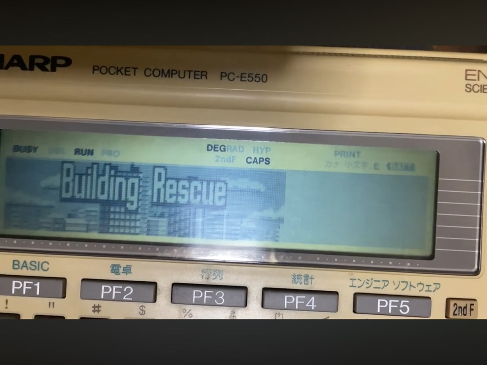
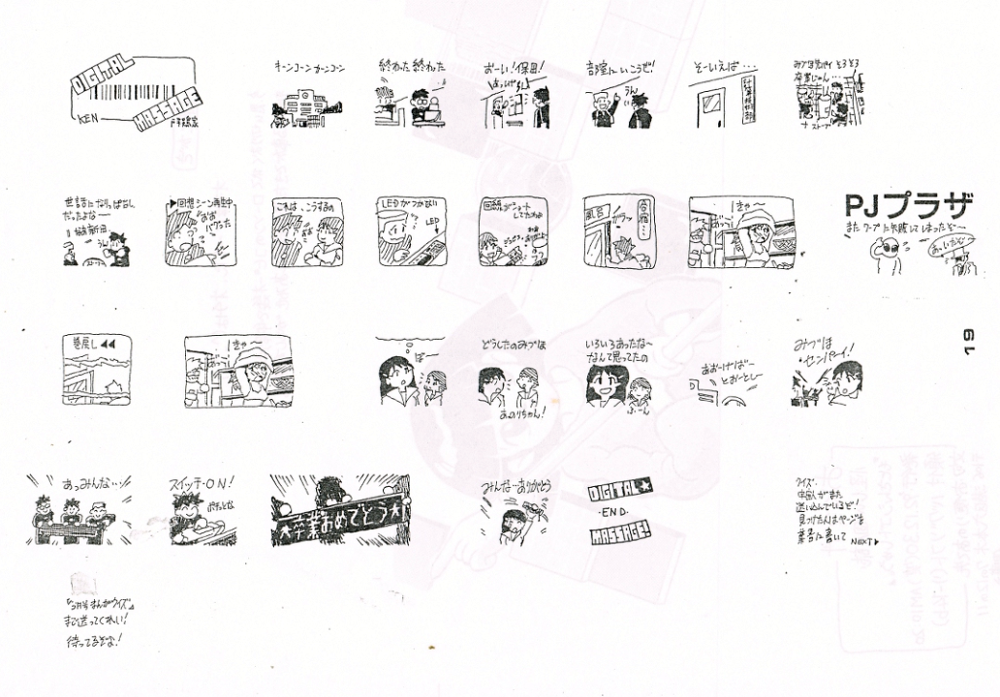

# Building Rescue Archive

Archive of **Building Rescue**, an action game for the SHARP **PC-E500 series** pocket computers.

This repository preserves the **original source code, binary, and documentation** for the game, along with historical notes and a gameplay demonstration.

A pseudo **4-level grayscale LCD technique** discovered during development is demonstrated in the **title screen** and the **ending demo**.

On the title screen, the effect is produced by alternating **two bitmap planes** with an explicit **2:1 time ratio**.

The ending demo uses the same two-plane display method, but its timing differs because **music playback is interleaved with the display loop**.

The slow response of early **STN LCD panels** blends these rapidly alternating frames, producing several apparent brightness levels **without spatial dithering**.

*This technique relies on the relatively slow response time of early STN LCD panels.*

Example captured from **real hardware (PC-E550)**.

---

# About

Building Rescue is a building-climbing action game for the **SHARP PC-E500 series**.

The player controls a climber ascending the exterior of a building while avoiding falling objects and enemy attacks in order to reach the rooftop and rescue **Mizuho**.

The game was originally created in **1994**, during the Japanese pocket computer hobbyist era.

According to the included documentation, the game features:

- full character animation
- pseudo-grayscale demo graphics (title and ending screens)
- enhanced sound
- PCM-style sound effects
- optional **SCC sound support**

If SCC hardware is not connected, the game can also use the built-in **BEEP sound**.

The game concept was inspired by the arcade game **Crazy Climber**.

---

# Platform

Tested on:

- **SHARP PC-E550**
- ROM Version **7.5**

Required environment:

- SHARP **PC-E500 series compatible machine**
- **32 KB RAM or more**

---

# Repository Structure

This repository is organized into the following directories:

## br110/

Original program data and source files:

- BR.OBJ — game object file  
- BR_original.asm — original assembler source  
- BR_UTF8.asm — UTF-8 converted source  
- BR.INF / BRINF.TXT — original distribution metadata  
- BR110.TXT — later archive notes (2008)
- br110.zip - orignai archive
## docs/

Documentation and reference materials:

- BR110-manual_ja.md / en.md — game manual  
- BR-inf_ja.md / en.md — original information text  
- OpeningDemo.jpg — real hardware capture  
- pj_plaza_comic.png — related comic material  

## analysis/

Technical analysis and reverse engineering notes:

- patch verification  
- binary analysis  
- hardware behavior documentation  

## build/

Reconstruction and build-related materials

---

# Running

The included documentation explains loading the object file at address **&BB000**.

Example BASIC commands:

POKE &BFE03,&1A,&FD,&B,&0,&50,&0:CALL&FFFD8  
LOADM "L:BR.OBJ"  
CALL &BB000

---

# Gameplay

The player climbs the building by alternating **left and right arm movement**.

While climbing, the player must:

- move horizontally to avoid falling hazards
- brace against certain obstacles
- continue ascending toward the rooftop

The game contains **four stages**, after which the game loops.

---

# Video

Gameplay demonstration on real hardware:

https://youtu.be/i-AIbPmVMRU?si=nEv5tjyE0GfvfhcW

---

## Documentation

### Manual
- docs/BR110-manual_ja.md — Japanese
- docs/BR110-manual_en.md — English

### Info
- docs/BR-inf_ja.md — Japanese
- docs/BR-inf_en.md — English

---

# Credits

**Kenkichi Motoi**

- game design  
- scenario  
- music  
- graphics  
- test play  
- debugging  

**GAME Shokunin**

- programming  
- debugging  
- test play  

---

# Contact

For questions or historical information about the game:

Motoi Kenkichi  
https://x.com/qptn/

Geimu Shokunin  
https://x.com/k2PSyIqxDKciBXA

You may also open an **Issue** in this repository.

---

# Historical Context

During the late 1980s and early 1990s, Japanese pocket computers such as the **SHARP PC-E500 series** supported an active hobbyist development culture.

Many original games and utilities were distributed through **magazines**, **bulletin board systems**, and later through early online archives such as **Vector**.

Building Rescue reflects this era of **independent software development on pocket computers**.

---

# Graphics Production

The game graphics were created using a **cross-development workflow** on the **NEC PC-9801**.

A custom conversion tool called **GVR2LCD.EXE** converted **PC-9801 two-plane VRAM image data** into **PC-E500 compatible assembler text**.

Both systems used the same pixel resolution and a similar two-plane structure, so the tool primarily converted the **bit ordering and VRAM layout** between the two machines.

---

# Preservation Note

This repository is intended as a **historical preservation archive** of the original PC-E500 game materials.

According to the included documentation (2008 archive notes), the author permits:

- analysis
- research
- modification
- redistribution

However, the documentation requests that **commercial reuse of the source code** be reported to the original author.

The original documentation from the **1994 archive** and the later **Vector distribution notes** are preserved in the included text files.

---

# Development History

Original version released **July 7, 1994**.

The original version of **Building Rescue** was first released on the BBS service **Pocket Communication** operated by **Kogakusha**.

A simplified version of the game titled **“Building Rescue Version 1.1 (mini)”** was later published in **Pocket Computer Journal**, September 1994 issue.

Authors:

- Kenkichi Motoi  
- GAME Shokunin  

---

# Related Material

The character **“Mizuho Senpai”**, who appears in this game, originally appeared in a small comic drawn by the author for the **“PJ Plaza”** section of *Pocket Computer Journal*.

---

# Related Projects

PLAY3 Archive  
https://github.com/gikonekos/PLAY3-Archive

---

## License

This project is based on the original software *Building Rescue* (1994).

The original program is distributed under the following freeware terms:

This repository exists for **historical preservation and research purposes**.

---

### XASM140 Original License (English)

This program is distributed as freeware.  
Copyright is retained by Eiji Kako and Shigeto Kon.

Redistribution and re-publication are permitted, provided that:
- the program is not modified,
- it is not used for commercial purposes, and
- the authors’ rights are not infringed.

As long as these conditions are met, the program may be freely distributed and shared.

Support is provided via the website:  
http://www.kako.com/

Useful sample code and related materials are available there.

Finally, we would like to express our gratitude to the original author, Shigeto Kon,  
for granting permission to modify and publish the source code and documentation.  
Thank you very much.

### XASM140 Original License (Japanese)

このプログラムはフリーウェアです。著作権は加古英児および近成人が保持します。  
配布や転載は、改変せずに、営利を目的とせずに、作者の持つ著作上の権利を侵害しないようにしてもらえれば、あとは自由に配布転載して結構です。

インターネットのWWWのページ( http://www.kako.com/ )にてサポートを行います。  
役に立つサンプルのコードなどを用意しております。

最後になりましたが、原作者の近成人氏には原作のソースとドキュメントに手を加え発表することを許可いただきました。どうもありがとうございました。

### Notes

- Copyright is retained by the original authors
- Redistribution is permitted if:
  - no modification is made
  - it is not used for commercial purposes
  - the authors' rights are not infringed

This repository preserves the original work and provides reconstruction and analysis for archival purposes.
